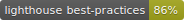

## 👨‍💻 Sutan Nst. Personal Homepage

[](https://app.netlify.com/sites/gallant-kowalevski-254d11/deploys) [](https://www.codacy.com?utm_source=github.com&utm_medium=referral&utm_content=sutanlab/sutanlab.id&utm_campaign=Badge_Grade) [](https://travis-ci.com/sutanlab/sutanlab.id) [](https://sutanlab.id) [](https://sutanlab.id) [](https://sutanlab.id) [](https://sutanlab.id) [](https://sutanlab.id) [](https://sutanlab.id)

> My Personal Homepage & Blog site with NuxtJS : https://sutanlab.id

### Required in System

- [NodeJS](https://nodejs.org/en/download/)

### Ongoing Features
- [x] Mobile friendly + offline-first with PWA Module
- [x] Beautiful but performant
- [x] Push notifications support
- [x] Reading-time
- [x] SEO Optimized
- [x] Image optimized
- [x] Feed RSS & Sitemap
- [x] Comment system with disqus
- [x] Social share (FB, Twitter, WA)
- [x] Posts pagination
- [x] Search posts
- [ ] Sorting posts by category & tags

### Build setup

``` bash
$ yarn install # install dependencies

$ yarn start # serve with hot reload at local server

$ yarn build # build for production

$ yarn test # test with jest environment

$ yarn score # generate lighthouse badges for deployed site with (if has lighthouse-badges cli)
```

This site use Nuxt.js Framework. [Read Nuxt.js Documentation](https://nuxtjs.org).

### Use make post template

``` bash
$ ./post -h # output instructions

$ ./post -c {POST_TITLE} # create post

$ ./post -d {POST_TITLE} # create draft post

$ ./post -p {POST_TITLE} # publish/promote a draft to a post
```

### Note

- How to resolve System limit for number of file watchers reached
```bash
$ sudo echo fs.inotify.max_user_watches=524288 | sudo tee -a /etc/sysctl.conf && sudo sysctl -p
```

- Integrate OneSignal Push Notifications with RSS Feed in [Zapier](https://zapier.com/apps/onesignal/integrations/rss/8120/send-onesignal-push-notifications-for-new-items-in-an-rss-feed)

### Special Thanks to :

- [Argon Design System](https://demos.creative-tim.com/vue-argon-design-system)
- [Marina Aisa](https://marinaaisa.com/blog/blog-using-vue-nuxt-markdown)
- [Vitor Britto](https://github.com/vitorbritto/forcefiles/blob/master/scripts/initpost.sh)

* * *

Copyright © 2019 by Sutan Gading Fadhillah Nasution
